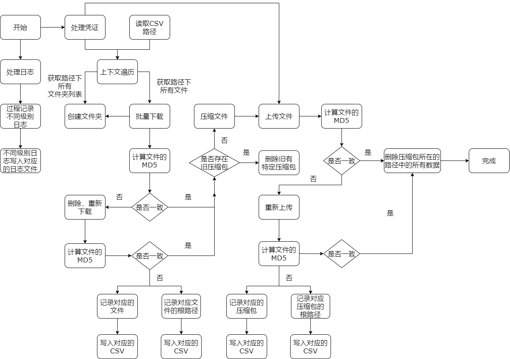

# 数据迁移一

## 项目概述
> 数据迁移，将 20TB+ 的数据从百度云（bce）BOS 迁移到AWS S3
> 文件总数量： 41,403,401
> 数据总大小： 19,110.17 GB (约19TB)
> CSV文件数量：4
> CSV文件路径数量：4*50000

## 目录结构
* [files](#测试数据) 测试数据
* [logs](#日志) 日志
* [requirements](#requirements) requirements.txt文件

## Architecture 架构图  
BOS to S3  

## 流程
1. 整体流程：从BOS下载数据->处理数据（下载、固定大小的压缩、保留目录、校验数据、记录日志）-> 上传压缩包至S3 

2. 具体步骤：
    * 从BOS，AWS获取凭证；BOS（AKSK，STS），AWS（角色，代码中配置，本地配置文件等）
    * 获取CSV文件目录；
    * 批量读取路径列表、文件；
    * 本地创建对应的目录结构；
    * 二次下载、校验BOS中的数据；
    * 将下载到EC2中的数据与BOS中的文件作MD5校验；
    * 在不同的路径压缩对应路径中的所有文件；压缩时，不包括根路径；删除过期的压缩包；
    * 二次上传至S3、上传完成后进行校验；
    * 批量删除上传完成后的压缩包，删除已经上传完成后的数据；
    * 下载，压缩、上传、校验过程记录不同等级的日志，根据级别输出到不同的文件中。
  

## Version 1.00
暂时只支持单线程